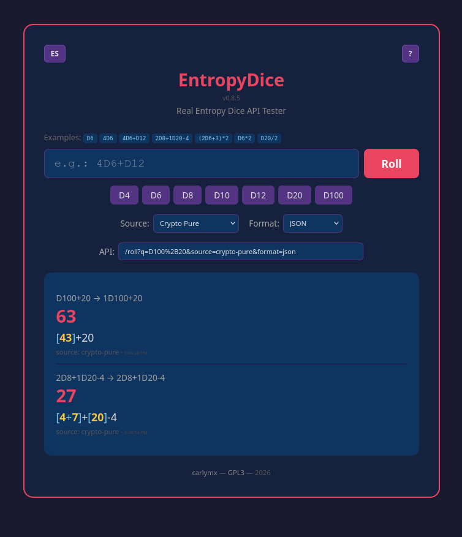

# EntropyDice - API 🎲


**True random dice for role-playing games. Cryptographically secure.**

REST API that generates real random numbers using the kernel's CSPRNG
(`/dev/urandom`) for D4, D6, D8, D10, D12, D20, and D100 dice. Supports
compound expressions like `4D6+D12`, `(2D6+3)*2` and modifiers like `2D8+1D20-4`.

> 📖 **Español:** [README_ES.md](README_ES.md)



The project includes, within the /public/ folder, a simple web page that demonstrates how the API works. However, its use is not mandatory: you can integrate the API into any of your projects without needing to include this test page.

---

## Quick start

```bash
npm install
npm start
# → EntropyDice API v0.8.7 at http://localhost:3000
```
## Usage

```bash
# Single die
curl "http://localhost:3000/roll?q=D6"

# Multiple dice
curl "http://localhost:3000/roll?q=4D6%2BD12"

# With modifier
curl "http://localhost:3000/roll?q=2D8%2B1D20-4"

# Percentile
curl "http://localhost:3000/roll?q=D100"

# Multiplication and division
curl "http://localhost:3000/roll?q=D6*2"
curl "http://localhost:3000/roll?q=D20%2F2"

# Complex expressions with parentheses
curl "http://localhost:3000/roll?q=%282D6%2B3%29*2"

# Plain text response
curl "http://localhost:3000/roll?q=4D6&format=text"

# Just the number
curl "http://localhost:3000/roll?q=4D6&format=raw"

# Hybrid source (Xoshiro128++ with 1h reseed)
curl "http://localhost:3000/roll?q=D20&source=crypto-xoshiro-ng"
```

**URL encoding:** `+` → `%2B`, `*` → `%2A`, `/` → `%2F`, `(` → `%28`, `)` → `%29`.

---

## API

| Endpoint | Parameters | Description |
|----------|-----------|-------------|
| `GET /` | — | API info and health check |
| `GET /roll` | `q`, `source`, `format` | Roll dice |

### Parameters

| Param | Default | Values |
|-------|---------|--------|
| `q` | — | Dice expression (required) |
| `source` | `crypto-pure` | `crypto-pure`, `crypto-xoshiro-ng` |
| `format` | `json` | `json`, `text`, `html`, `raw` |

### Valid dice

`D4`, `D6`, `D8`, `D10`, `D12`, `D20`, `D100`

### Response formats

| Format | Content-Type | Example |
|--------|-------------|---------|
| `json` | `application/json` | `{"total": 15, "detail": "[5+3]+[7]", ...}` |
| `text` | `text/plain` | `[5+3]+[7] = 15` |
| `html` | `text/html` | Styled HTML page |
| `raw` | `text/plain` | `15` |

### True randomness vs pseudo-randomness

Most virtual dice are pseudo-random. EntropyDice is true randomness.
Plain and simple.

Traditional systems use mathematical formulas to generate numbers
that look random, but aren't. Given the same starting point (the
"seed"), they always produce the same results. If someone discovers
that seed, they can predict every roll before it happens.

EntropyDice works differently. It offers two modes:

| Mode | Source | Type | Speed | Capacity |
|------|--------|------|-------|----------|
| **Pure entropy** | `crypto-pure` | Randomness gathered from electronic device noise | ~500K rolls/s | ~5k-50k simultaneous users |
| **Ultra-fast hybrid** | `crypto-xoshiro-ng` | Near-true randomness with periodic renewal | ~180M rolls/s | ~1.8M-18M simultaneous users |

**crypto-pure** — For when true randomness is the priority
(its default state). Every roll is generated from imperceptible physical
phenomena inside the server (electrical noise, vibrations, temperature).
There is no starting number from which others can be deduced. Slower,
but 500,000 rolls per second still handles thousands of players.

**crypto-xoshiro-ng** — For when you need speed without sacrificing
security. It works in three layers:

1. **Seed renewed every hour** — Every 60 minutes (configurable) a fresh seed
   is generated from true random system processes. No seed is ever reused.
2. **High-speed engine** — A rigorously tested number engine running
   directly from server memory, no bottlenecks, with number sequences
   so long they surpass the age of the universe.
3. **Mixed with the exact instant** — Each number is combined with
   the precise timestamp it was requested, so even simultaneous rolls
   produce completely different results.

The result: a system that, while technically algorithm-generated, is
so intricate — renewable true-random seed + high-speed engine + temporal
fingerprint — that it far surpasses any traditional PRNG like Mersenne
Twister.

Need truly random numbers? Use `crypto-pure`.
Need speed without worries? `crypto-xoshiro-ng` has you covered.

For true randomness and a simple API that anyone can host on their own
server without depending on third parties, EntropyDice is your best
option. 💪

### Sources

| Source | Description |
|--------|-------------|
| `crypto-pure` | True server entropy — seedless, stateless, unbiased. ~500K rolls/s |
| `crypto-xoshiro-ng` | Hybrid: renewable seed + fast engine + temporal mix. ~180M rolls/s |

---

## Full documentation

See the complete interactive documentation at:

👉 **https://entropydice.onrender.com/help/en.html**  *(when deployed)*

Or open `public/help/en.html` locally.

---

## License

[](https://www.gnu.org/licenses/gpl-3.0.html)

This program is free software: you can redistribute it and/or modify it under the terms of the GNU General Public License as published by the Free Software Foundation, either version 3 of the License, or (at your option) any later version.

See the [GNU General Public License v3.0](https://www.gnu.org/licenses/gpl-3.0.html) for details.

---

## Changelog

### v0.8.7 — 2026-07-06
- **Visual dice calculator**: number buttons (0-9) and operator buttons (+, -, *, /, (), )) in the frontend
- **Accumulate mode**: die buttons build expressions instead of auto-rolling
- **True randomness narrative**: new section in both READMEs with speed and capacity tables
- **3-phase flow diagram**: ASCII pipeline added to `docs/RNG_REFERENCE.md`
- **API field fix**: removed fixed min-width for mobile responsiveness
- **Credits updated**: GitHub repo link added to frontend footer

### v0.8.6 — 2026-07-05
- **RNG Reference refactored**: documentation for `crypto-pure` and `crypto-xoshiro-ng` moved to `/docs/`
- **Version bump**: 0.8.5 → 0.8.6

### v0.8.5 — 2026-07-04
- **Bilingual frontend**: EN/ES toggle button on the API tester with full i18n,
  browser language detection, and localStorage persistence
- **Help icon**: `?` button next to the language switcher opens the docs in the
  current language
- **LICENSE file**: GPL-3.0 added to repository

See [CHANGELOG.md](CHANGELOG.md) for full history.
